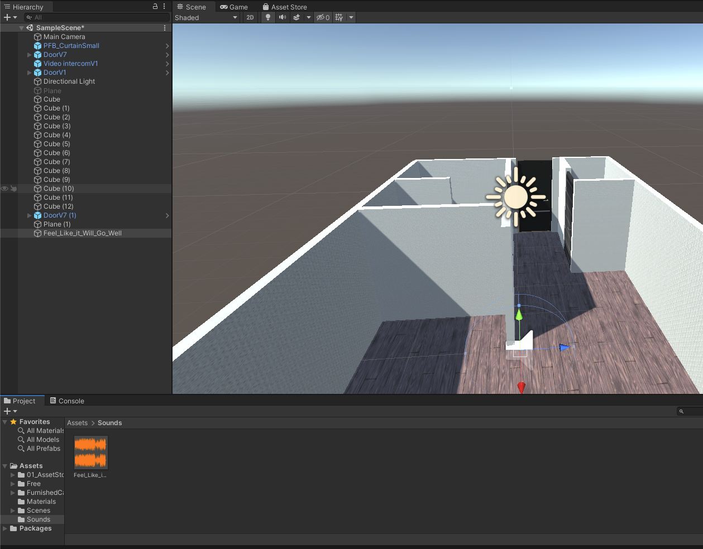
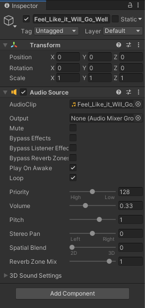
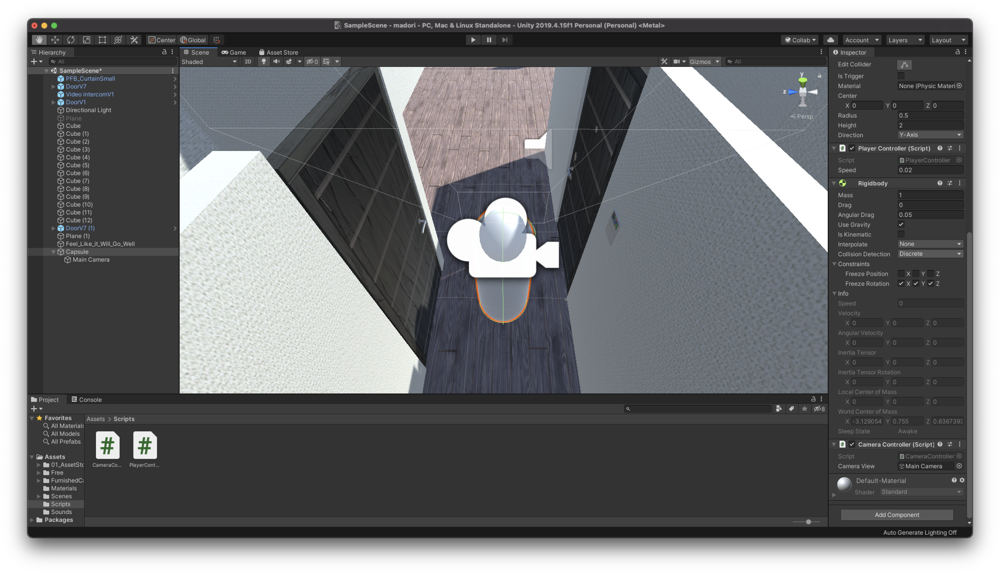
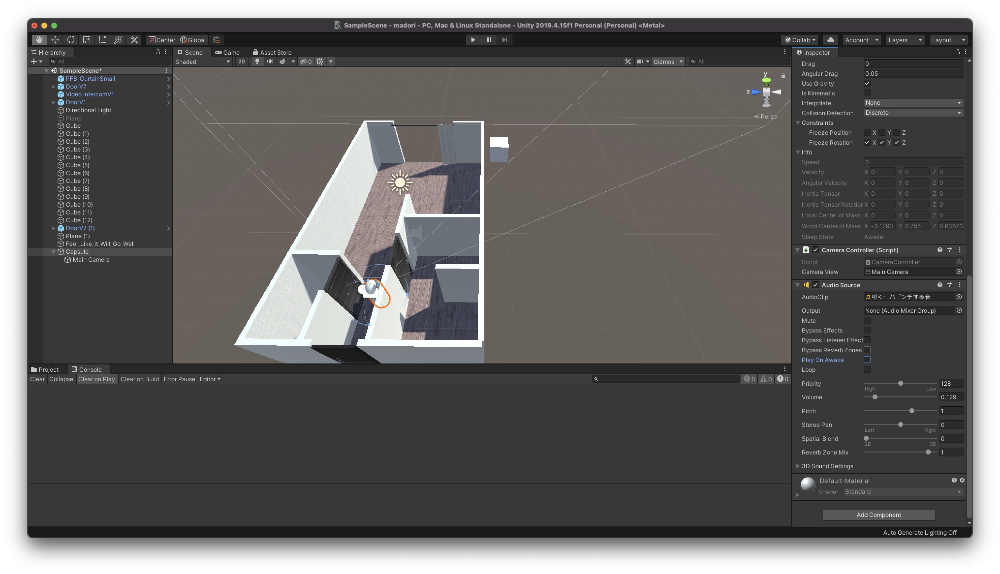
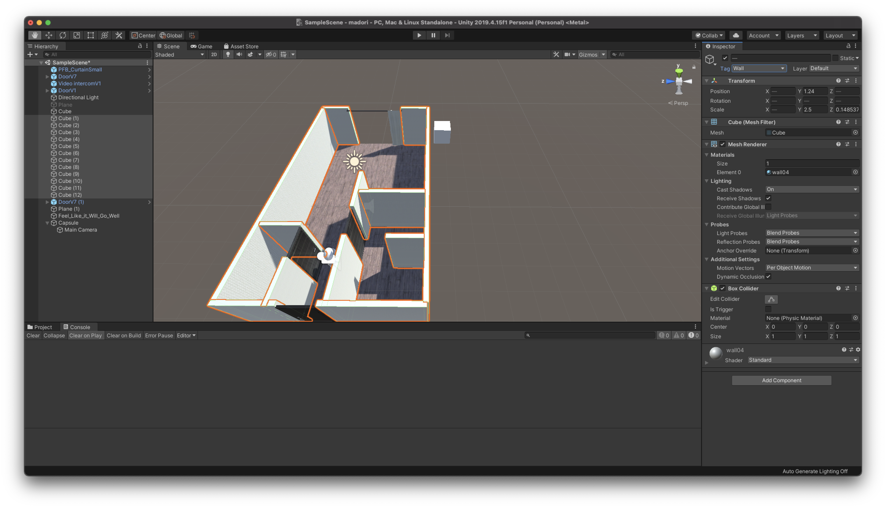

# アプリケーションに音を追加してみる

## UnityのAudio

<br>

Unityのオーディオ機能は、フル3Dサウンド、リアルタイムミキシングとマスタリング機能、ミキサーのヒエラルキー、スナップショット、定義済みエフェクトなどを備えています。

ゲームにバックグラウンドで流れる音楽やサウンドエフェクトは欠かせません。多くの一般的なオーディオファイルフォーマットをインポートすることができ、3D空間でサウンドを作成するための機能、さらにエコーやフィルタリングのようなエフェクトを備えています。

Unityでは位置の影響をシュミレートするために、AudioSourceのついたオブジェクトから発生する音が必要になります。発生した音はAudioListenerのついた他のオブジェクト（主にメインカメラ）に拾われます。Unityはリスナーオブジェクトからソースまでの距離と位置の影響をシュミレートし、それに応じて再生された音をユーザーに届けます。ドップラー効果によるリアリズムを加えるため、ソースとリスナーオブジェクトの相対速度もシュミレートされます。

Unityはシーンのジオメトリから正確なエコーを計算することはできませんが、オブジェクトにAudioFilterをつけることによってシュミレートすることができます。

UnityはAIFF、WAV、MP3、Ogg形式のオーディオファイルを他のアセットのようにプロジェクトパネルにドラッグしてインポートしることができます。オーディオファイルをインポートすることでオーディオクリップが作成され、オーディオソースやスクリプトによって使用されます。オーディオクリップのリファレンスページにはオーディオファイルで使用可能なインポートオプションについての詳細が載っています。

<br>

## BGMを追加してみよう

まず初めにアプリケーション内で常に再生されるBGMをつけてみたいと思います。

Unityのプロジェクトを開き、BGMとして流すための音データをインポートしてください。

音データはUnityのアセットストアからダウンロードしても構いませんし、別のサイトからダウンロードして使用しても構いません。  
著作権にのみ気をつけてください。

形式は上記に書いてあるものを使用します。


<br>



音データをUnityのAssetsフォルダにインポートしたら新規でSoundsフォルダを作成し、その中に格納してください。

そしてその音データをヒエラルキーウィンドウにドラッグ&ドロップしましょう。

そうすると上記の画像のように音データがUnityのシーン内に配置されます。


<br>



インスペクターウィンドウを見てみると、このように自動的にAudioSourceコンポーネントが追加されています。
デフォルトで「Play On Awake」のチェックがついているかと思います。  
これはこのシーンが開いた時に自動的にこの音データを再生させることができるようにするという意味です。

今回はBGMなのでその下の「Loop」にもチェックを入れてください。  
これでこの音データをループで再生させることができます。

このままだと少しBGMが大きすぎるので、下のVolumeを調整してください。

ここまで終わったら、一度実行してみましょう。

無事にBGMが鳴っていれば成功です。

<br>

## 効果音を追加してみよう

無事BGMが鳴ったので、次は効果音を鳴らしてみたと思います。

今回は単純にプレイヤーが壁に当たったら当たったような効果音を再生するようにしたいと思います。これを応用すれば、例えば家具に当たった場合の音や、メニューの操作音等を自由に設定することができます。

効果音を追加するに当たって、まずはプレイヤーを配置する必要があります。

プレイヤーの配置方法や移動方法などは[こちら](https://hinode000jp.github.io/UnityTextBook3/page1.html)の教科書を参考に作成してください。




教科書をみながら作成してもらえれば、このようにキーボードとマウスで操作できるプレイヤーを作成できているかと思います。  

<br>

### 効果音をインポート


  
まずは壁にぶつかった時の効果音をUnityのアセットストアか別のサイトなどからインポートしてください。

そしてSoundsフォルダに格納しておきましょう。

<br>



次にPlayerとなるカプセルにAudioSourceコンポーネントをアタッチします。  
今回は当たった時に効果音を鳴らすので、Play On Awakeのチェックは外しておきましょう。  
そしてAUdioSourceコンポーネント内のAudioClipの場所にプロジェクトウィンドウから今回再生する効果音をドラッグ&ドロップしてください。

ここでもボリューム等を調整しておきます。（実際に聞いてから修正しても構いません）

AudioSourceは音を再生するためのプレイヤーのような役割を果たします。

<br>

次にVisualStudioでPlayerControllerスクリプトを開き、コードを以下のように変更してください。

```c#
using System.Collections;
using System.Collections.Generic;
using UnityEngine;

public class PlayerController : MonoBehaviour
{
    public float speed = 0.02f;
    AudioSource audioSource;

    private void Start()
    {
        audioSource = GetComponent<AudioSource>();
    }

    // Update is called once per frame
    void Update()
    {
        float x = Input.GetAxis("Horizontal");
        float z = Input.GetAxis("Vertical");

        transform.Translate(x * speed, 0.0f, z * speed);
    }

    private void OnCollisionEnter(Collision collision)
    {
        if (collision.gameObject.CompareTag("Wall"))
        {
            audioSource.Play();
        }
    }
}
```

`AudioSource audioSource;`で AudioSource型の変数を定義し、Startメソッド内でカプセルについているAudioSourceを取得しています。

次に`private void OnCollisionEnter(Collision collision)`でオブジェクト通しの衝突が発生した時にこちらのメソッドが実行されるようにします。

そして`if (collision.gameObject.CompareTag("Wall"))`でもしカプセルと衝突したオブジェクトのタグがWallだった場合という条件下で、`audioSource.Play();`というコードで効果音を再生するようにしています。
ここまで書けたらコードを保存してUnityに戻りましょう。




最後に壁のオブジェクト全てに「Wall」という名前のタグを作成し追加してください。  
ここまでできたら一度実行してみましょう。  

プレイヤーが壁にぶつかった時に効果音が流れていれば成功です。